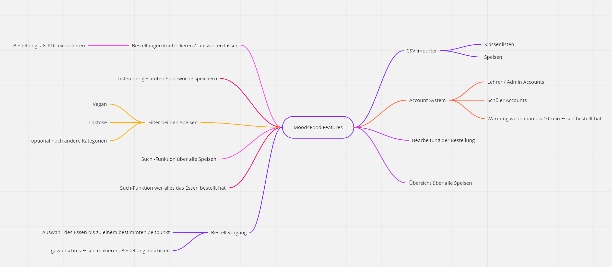
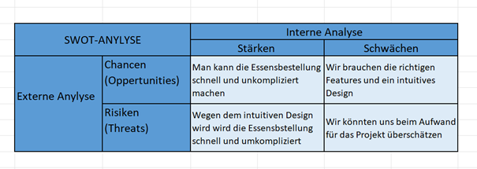

# Projektantrag - Mood4Food

Verwenden Sie ein Dokumentenformat Ihrer Wahl, aber halten Sie die Vorgaben zur Kapitelstruktur und Inhalt ein:

## 1. Ausgangslage

### 1.1. Ist-Situation

Wie jedes Jahr fahren alle 2 Klassen auf Sportwoche nach Bibione. Bei der Hinfahrt im Bus entsteht meistens ein totales Chaos, denn es müssen viele organisatorische Aufgaben bewältigt werden. Durch diese Eile entstehen häufig einige Fehler du später nur schwer zu beheben sind. Ein Teil davon ist die Essensbestellung aller Schüler für die gesamte Woche

### 1.2. Verbesserungspotenziale

- **Probleme**

  - Chaos bei der Zetteldurchgabe
    - Schüler machen Fehler beim Eintragen
  - Mangelnder Platz

    - Da die Speisekarte auf 3 Zettel gedruckt ist und man auf einem seperaten Zettel schreiben musss, ist man ziemlich überfordert.

  - Speisen sind nicht klar gekennzeichnet

    - Es steht nicht bei der Speise ob sie vegan/ vegetarisch ist.
    - Es gibt keinen Hinweis auf die Allergene auf der Speise.

  - Auswertung der Zettel ist ein hoher Aufwand
    - Man kann bei der großen Anzahl der Schüler/Bestellung leicht Fehler machen

- **Verbesserungen**

  - Verbsserung bei der Auswahl der Speisen

  - Speisekarte übersichtlicher gestalten

  - Eine vereinfachung der Auswertung ist nötig, da man sich viel Zeit und Aufwand spart

## 2. Zielsetzung

Unser Ziel ist es, den Bestellvorgang zu vereinfachen und so Zeit und Nerve der Lehrer und Schüler zu sparen.

Dieses Ziel wollen wir mithilfe einer Website erreichen, die all diese Probleme löst. Unsere Website soll das Bestellen für Schüler wehsentlich vereinfachen

### **Lehrkraft (Admin-Autorisierung, Desktop/WebApp):**

- Bestellmanagement:
  - CSV-Import Klassenlisten
  - Einstellen Bestelltage und -fristen (z.B. 11:00 gleicher Tag)
  - Bestellungen des Tages kontrollieren und fehlende Bestellungen einfordern
  - Bestellungen des Tages exportieren und an Pizzeria übermitteln (Alternativ eigener Online-Zugang für Pizzeria => selbst Speisen bearbeiten?)
- Speisenmanagement:
  - CSV-Import Speisen (initial)
  - Bearbeiten Speisen
- Archivieren nach Sportwochen-Ende
- PDF-/Excel-Export der Bestellung nach der Bestellfrist

### **Student-Zugang Mobile/WebApp:**

- Auswahl einer Speise bis spätestens Bestellfrist (ideal gleich für alle Tage, aber innerhalb Bestellfrist jederzeit änderbar)
- Übersicht bestellte Speisen
- Quick-Search während Essensausgabe:
  - Eigene Tagesbestellung fokussiert (Nummer und Name der Speise)
- Quick-Search für Lehrkraft/Schüler:
  - Suche nach Speise und Auflisten aller SchülerInnen, die die Speise bestellt haben

### Mind Map

## 3. Chancen und Risiken

Risiken: Ein nicht zu unterschätzendes Risko ist das wir den Aufwand unterschätzen und dann eventuell wichtige Features nicht mehr einbauen können.

Chancen: Wir können auf jeden Fall die Essensbestellung auf der Sportwoche für Schüler und Lehrer vereinfachen. Ein weiterer Vorteil wäre, dass man das System dann auch weiter ausbauen und für andere Schulische Aktivitäten nutzen kann, wie zum Beispiel für eine Skiwoche usw.

### SWOT Analyse

## 4. Planung

### 4.1. Rahmenbedingungen

#### **Team-Regeln**

- kooperative Zusammenarbeit
- gerechte Aufteilung der Aufgabenbereiche nach ...
  - Erfahrung
  - Können
  - Wunsch
- "Die Mehrheit zählt" - Abstimmen über diverse Entscheidung
- lesbarer Code für Teammitglieder (=Clean Code)

#### **Finanzielle Mittel**

- kostenlose Programmierumgebung (unterstützt durch HTBLA Leonding)
- gegebenfalls Gebühren für Servererhaltung

### 4.2. Meilensteine

Um einen stetigen und geplanten Fortschritt zu erhalten, wird der Gesamtprozess in zwei Teile geteilt

1. Wintersemester: Planung
2. Sommersemester: Umsetzung

#### **Wintersemester**

Im ersten Semester werden großteils Bereiche wie angezieltes Design und zukünftige Features geklärt und gegebenfalls die Umsetzung gestartet.

- Planung von...
  - Design (Farbenpallette, Abrundungen, etc.)
  - Features
  - Extras
  - Aufgabenverteilung
- Beginn der Umsetzung
  - Prototyp der Website

#### **Sommersemester**

Im zweiten Semester wird der Fokus auf die Umsetzung der Planung gelegt. Weitere Features können unter der Absprache mit dem Team hinzugefügt werden.

- Umsetzung der Planung vom WS
- komplexes BackEnd Development
- finalle Testung
