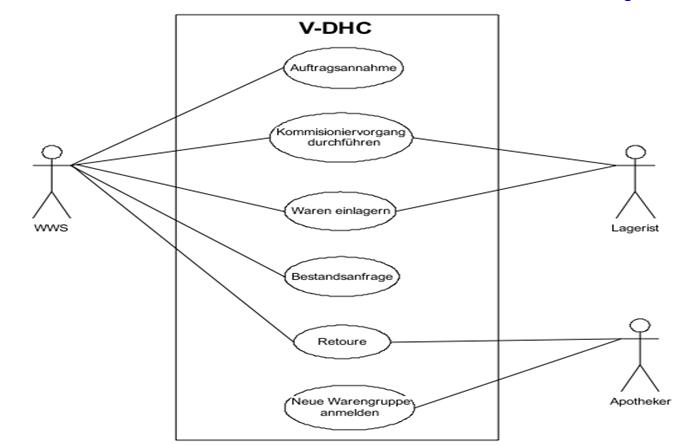
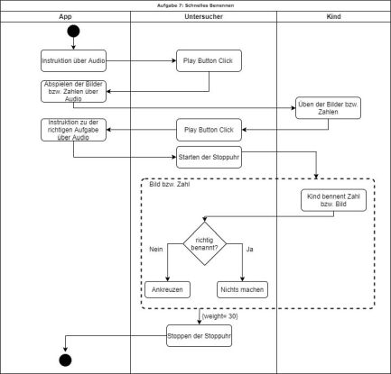
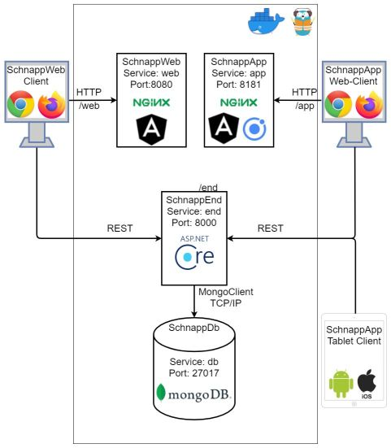

# System-Spezifikation `Mood4Food`

## 1. Ausgangslage und Zielsetzung

### 1.1. Ist-Situation

- Siehe Projektantrag

### 1.2. Verbesserungspotenziale

- Siehe Projektantrag

### 1.3. Zielsetzung

- Siehe Projektantrag

## 2. Funktionale Anforderungen

Dieser Abschnitt hat die Aufgabe, die Funktionalität des zu entwickelnden Systems aus End-User-Sicht sowohl überblicksartig als auch detaillierter zu beschreiben.

### 2.1. Use Case Überblick

- Ein oder mehrere `UML Use Case Diagramme` (=> siehe https://hoelzel.at/flip/160775/280/index.html S. 280 - 282) visualisieren das gesamte geplante Featureset im Groben
- Basis dafür ist die Mindmap aus dem Projektantrag => Ergänzen Sie relevante Rollen (für welche User-Gruppe ist ein Feature wichtig?)
- Mit kurzen verbalen Beschreibungen der Diagramme

Wenn Sie mehrere benötigen - verwenden Sie Unterkapitel der Ebene 3 dafür:

#### 2.1.1. Use Case Diagramm A

#### 2.1.2. Use Case Diagramm B

etc..

### 2.2. Use Case A

Nun folgen Detailbeschreibungen für alle Use Cases aus dem Use Case Diagramm. Für jeden Use Case sind folgende Details notwendig:

#### 2.2.1 GUI-Design

- Zeigen Sie hier den GUI-Mockup, den Sie für diesen Use Case designed haben (mit Figma oder einem anderen GUI-Mockup-Tool Ihrer Wahl)
- Ergänzen Sie das Bild mit verbalen Beschreibungen, wenn nötig.
- Beispiel:

#### 2.2.2 Workflow

- Erklären Sie hier die internen Abläufe, die für die Umsetzung des Use Cases notwendig sind
- Verwenden Sie dazu - wenn der Ablauf komplex genug ist - ein `UML Activity Diagram`
- Beispiel:

### 2.3. Use Case B

... nächster Use Case, usw.

## 3. Nicht-funktionale Anforderungen

Nicht-funktionale Anforderungen beschreiben Anforderungen an das System, die nicht-fachlicher Natur sind, jedoch entscheidend zur Anwendbarkeit des Systems beitragen. Sie definieren beispielsweise Qualitätsanforderungen, Sicherheitsanforderungen oder Performanceanforderungen.

Nicht-funktionale Anforderungen definieren grundlegende Eigenschaften eines Systems, die im Architekturentwurf berücksichtigt werden müssen. Da diese Anforderungen auch die Entwicklungskosten beeinflussen (können), müssen sie messbar beschrieben werden.

- FALSCH: Das System muss schnell sein.
- RICHTIG: Daten müssen spätestens innerhalb von 500 ms zurückgegeben werden.

Zur einfachen Strukturierung der Anforderungen werden diejenigen Anforderungen, die nicht eindeutig zu den funktionalen Anforderungen gehören, den nicht-funktionalen Anforderungen zugeordnet.

Hier ein Überblick über mögliche nicht-funktionale Anforderungen:

### `Usability`: Benutzbarkeitsanforderung

- Wie muss die Software beschaffen sein, damit die Zielgruppe gerne damit arbeitet?
- Beispiel:
  - Die Software soll dem Erscheinungsbild anderer Produkte des Herstellers entsprechen.

### `Efficiency`: Effizienzanforderung

- Hier geht es sowohl um Laufzeit- als auch um Speichereffizienz. Was wird unter dem sparsamen Einsatz dieser Ressourcen verstanden?
- Beispiel:
  - Die Berechnung darf nicht länger als 0,25 Sekunden dauern.

### `Maintenance`: Wartbarkeits- und Portierbarkeitsanforderung

- Welcher Grad an Änderbarkeit wird gefordert? Hier werden, soweit wie möglich, kommende Anpassungen und Erweiterungen vorhergesehen.
- Beispiel:
  - Das Produkt soll später auch in englischer Sprache verfügbar sein.

### `Security`: Sicherheitsanforderung

- Zu den Sicherheitsanforderungen gehören die Aspekte Vertraulichkeit, Datenintegrität und Verfügbarkeit.
  - Wie sehr müssen die Daten vor dem Zugriff durch Dritte geschützt werden?
  - Ist es entscheidend, die Korrektheit der erfassten Daten und ihre Konsistenz zu gewährleisten?
  - Dürfen Systemausfälle vorkommen?
- Beispiel:
  - Das System muss gewährleisten, dass Daten nie verändert werden können.

### `Legal`: Gesetzliche Anforderung

- Welche Standards und Gesetze müssen beachtet werden?
- Beispiel:
  - Das Produkt muss die ISO 9000 Norm erfüllen.

## 4. Mengengerüst

Zur Abschätzung der aufkommenden Datenmengen und damit verbunden der notwendigen Infrastruktur, um die nötige Performance zu erzielen, ist ein Mengengerüst zu erstellen. Mögliche Fragestellungen:

- Wieviele User werden erwartet?
- Wieviele Daten pro User werden erwartet?
- Mit welcher Anfrage-Frequenz wird gerechnet?

## 5. Systemarchitektur

- Auflistung der Softwarekomponenten in einem Verteilungsdiagramm (typisch: Client - Server - Datenbank).
- Beispiel:

