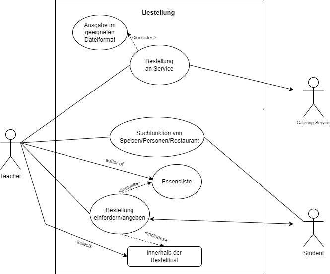
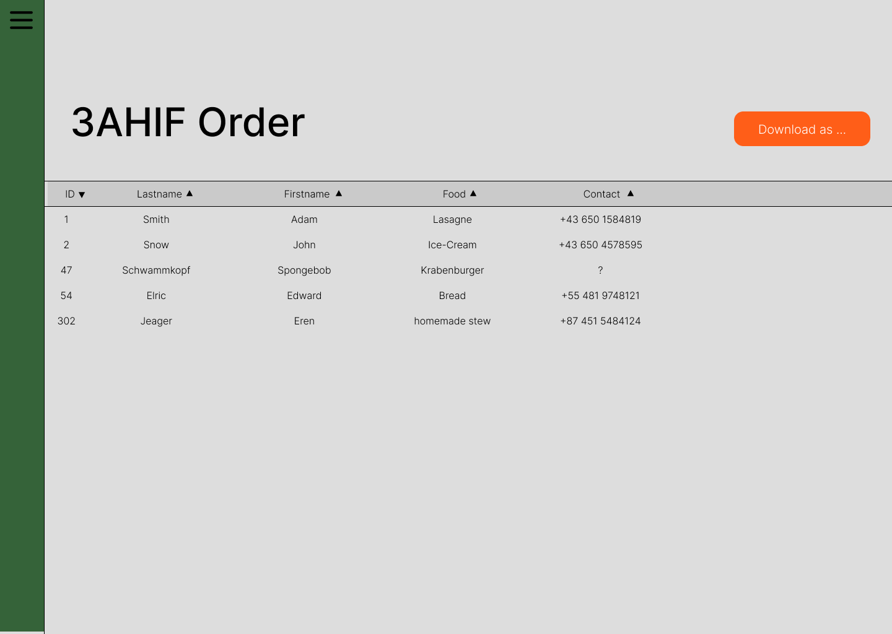
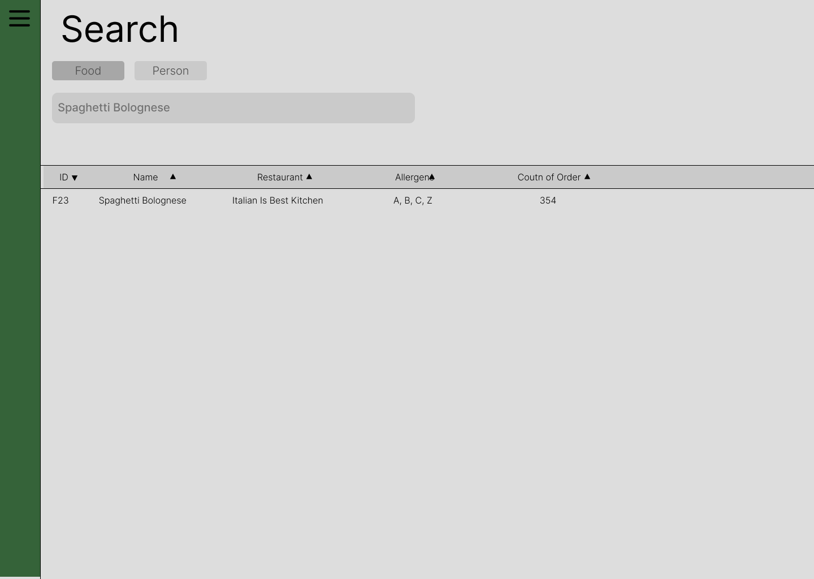
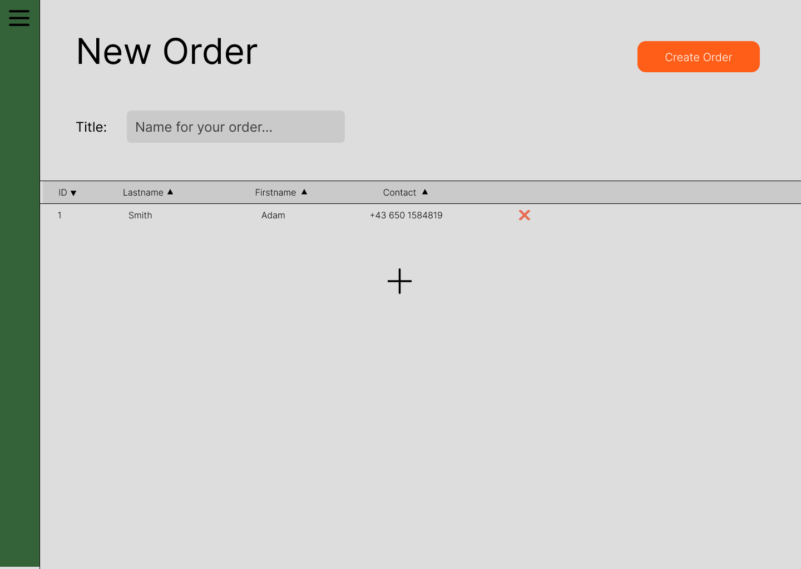

# System-Spezifikation `Mood4Food`

## 1. Ausgangslage und Zielsetzung

### 1.1. Ist-Situation

- Siehe Projektantrag

### 1.2. Verbesserungspotenziale

- Siehe Projektantrag

### 1.3. Zielsetzung

- Siehe Projektantrag

## 2. Funktionale Anforderungen

Im großen Ganzen kann man sich auf der Website/Webapp auf 2 Arten registrieren/anmelden. Entweder als <strong>Lehrer</strong> oder als <strong>Schüler</strong>, welche dann natürlich unterschiedliche Rechte auf der Anwendung besitzen.

### 2.1. Use Case Überblick

Bei diesem Diagramm haben wir wie schon gesagt, den Lehrer und der Schüler als Benutzer des Programms.  
Wie man sieht hat der Lehrer viel mehr Rechte, aber auch viel mehr zu tun.

### 2.2 Bestellung an Service

#### 2.2.1 <strong> GUI-Design </strong>

Ist die Bestellung vollständig abgeschlossen, kann der Lehrer die Bestellungen als PDF-,Excel-,usw. herunterladen. 
In der Datei werden jegliche Information angeben die für die Bestellung notwendig sind, wie zum Beispiel der Name des Schülers, usw.

#### 2.2.2 <strong> Workflow </strong>

Auf der Website kann der Lehrer mithilfe des Download-Button auf der Hauptseite der Bestellung, eine Date vom Typ PDF oder auch Excel herunterladen. 
Der Prozess startet, wenn der Benutzer auf den Button klickt.
Danach wählt dieser aus, welche Art von Datei er haben will.
Hierbei werden die Daten der Teilnehmer (Schüler sowie auch Lehrer) vom Server geholt und in die jeweilige Datei eingetragen.

### 2.3 Suchfunktion von Speisen/Personen

#### 2.3.1 <strong> GUI-Design </strong>

Die Suchfunktion ist für jeden Benutzer zugänglich. Zusätzlich ist unterscheidbar, nach was man suchen will. Nämlich Speisen und Personen, von denen man bestellt. (?eigene Side für jede Speise/Person/Firma, wenn man darauf klickt)  
Sucht man nach <strong>Speisen</strong>, kann man auch sehen, welche Zutaten diese Mahlzeit beinhaltet (Zutaten, Allergene, etc.) und wer diese Speisen bereits bestellt hat (oder auch nur die Anzahl). 
<strong>Personen</strong> können entweder mithilfe der IDs oder einfach mit dem Namen gefunden werden. Ähnlich wie bei den Speisen kann man bei den Personen Namen und unpersönliche Daten sowie von ihnen bestellte Speisen sehen.  

#### 2.3.2 <strong> Workflow </strong>

Es gibt 2 Arten wie man Speisen oder Personen suchen kann:

- die ID
- den Namen

Davor muss man auswählen, wonach man sucht (Default ist Food). 
Sucht man also nach einer Speise names Spaghetti Bolognese, geht das Programm alle Speisen durch und vergleicht die Eingabe mit der ID und den Namen der Speisen. 
Das oder die Ergebnisse werden ausgegeben.

#### <strong>Essenliste</strong>

Wird vom Lehrer mit den nötigen Speisen "befüllt" und bearbeitet. Darauf zugegriffen wird von dem Bestellprozess und der Suchfunktion

#### <strong>Bestelltage/-frist</strong>

Der Lehrer setzt mit dem Bestellprozess eine bestimmte Frist oder eine bestimmte Anzahl von Tagen, wo die Schüler udn eventuell auch Lehrer bestellen können. Außerhalb dieser Zeitzone kann die Bestellung nicht verändert werden.

### 2.4 Der Bestellprozess

#### 2.4.1 <strong> GUI-Design </strong>

Ein Lehrer kann eine neuer Bestellung beantragen/erstellen (Siehe Bild) und eine bestimmte Anzahl von Schülern zur Eintragung auffordern.  
Die Schüler haben daraufhin bis zum Ende der Frist Zeit sich eine Speise auszusuchen. Der Lehrer kann jederzeit Schüler ohne Bestellung dazu auffordern, eine Bestellung auszusuchen. Zum Beispiel, wenn die Frist beinahe zu Ende ist.

#### 2.4.2 <strong> Workflow </strong>

// missing text

## 3. Nicht-funktionale Anforderungen

Da es sich hier um ein Tool handelt, dass Bestellungen schnell und einfach zusammenfassen soll, ist es schnell klar welche Bereiche hier sehr wichtig sind. 
Eben <strong>Schnelligkeit</strong> und <strong>Einfachkeit</strong>.

### `Usability`: Benutzbarkeitsanforderung

- Die Website soll benutzerfreundlich wirken und es sollte leicht sein sich zurechtzufinden

### `Efficiency`: Effizienzanforderung

- Die Ergebnisausgabe bei der Suche darf nicht zu lange dauern (nicht mehr als 5 Sekunden)

### `Maintenance`: Wartbarkeits- und Portierbarkeitsanforderung

- ein funktionierender Darkmode soll später eingebaut werden
- eventuell Deutsch

### `Security`: Sicherheitsanforderung

- Programmierung muss effizient genug sein, dass Systemaussfälle so gut wie möglich vermieden werden

- Es werden nur Daten benötigt, die nicht zu persönlich sind. (Name, Email-Adresse, eventuell Geburtsdatum).
  Jedoch muss das System garantieren, dass die Daten der Benutzer durch Dritte mindesgeschützt ist.

### `Legal`: Gesetzliche Anforderung

- Einhaltung der Datenschutz-Grundverordnung (EU) 2016/679

## 4. Mengengerüst

- Wieviele User werden erwartet?
  - 100 User
- Wieviele Daten pro User werden erwartet?
  
- Mit welcher Anfrage-Frequenz wird gerechnet?

## 5. Systemarchitektur

