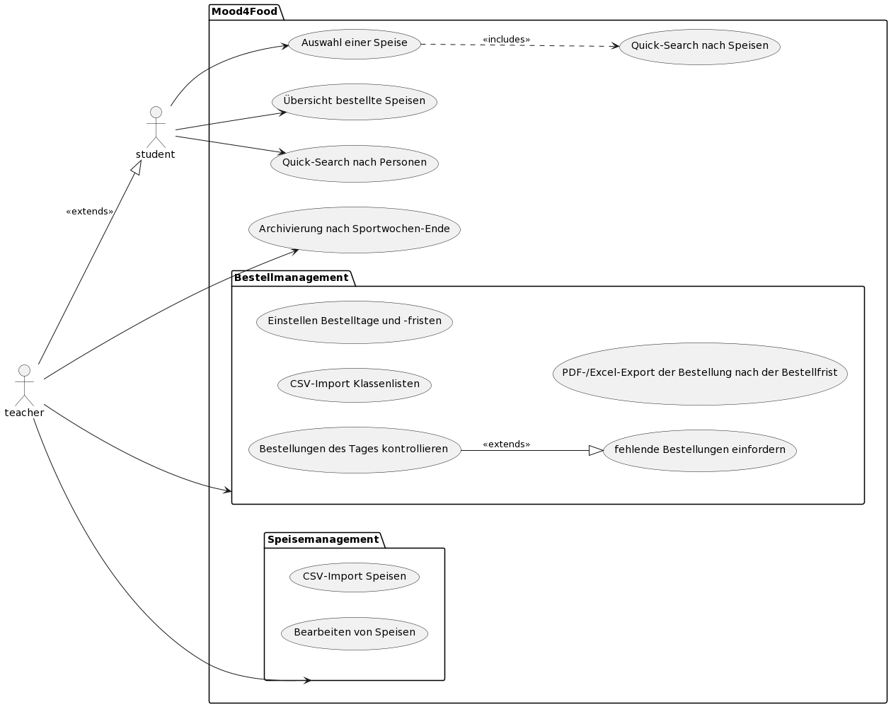
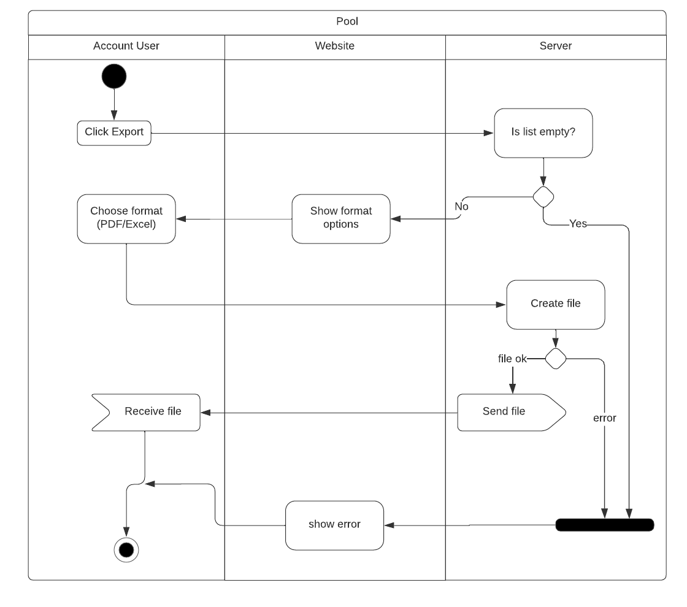
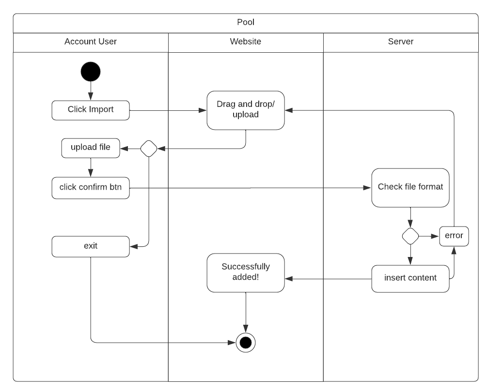

# System-Spezifikation `Mood4Food`

## 1. Ausgangslage und Zielsetzung

### 1.1. Ist-Situation

- Siehe Projektantrag

### 1.2. Verbesserungspotenziale

- Siehe Projektantrag

### 1.3. Zielsetzung

- Siehe Projektantrag

## 2. Funktionale Anforderungen

Im großen Ganzen kann man sich auf der Website/Webapp auf 2 Arten registrieren/anmelden. Entweder als <strong>Lehrer</strong> oder als <strong>Schüler</strong>, welche dann natürlich unterschiedliche Rechte auf der Anwendung besitzen.

### 2.1. Use Case Überblick

Bei diesem Diagramm haben wir wie schon gesagt, den Lehrer und der Schüler als Benutzer des Programms.  
Wie man sieht hat der Lehrer viel mehr Rechte, aber auch viel mehr zu tun.

### 2.2 PDF-/Excel-Export der Bestellung(en) nach der Bestellfrist

 
Für den Lehrer gibt es eine weitere Liste. Und zwar die der einzelnen Bestellungen der Schüler mit der BestellID und einigen weiteren Daten (OrderID, Name, Food, FoodID) pro Bestellung.

Obendrein sind ist die Bestellfrist zu sehen (Start-Ende), man hat auch die Möglichkeit nach bestimmten Schülern und Speisen zu suchen (siehe Quick-Search für Students/Speisen) und die "Standard-Table-Sortierungen" (Sortierung nach den einzelnen Spalten).  

Das wichtigste ist jedoch die <strong>Exportfunktion</strong>.  

Hierbei haben wir den <strong>Account Benutzer</strong>, die <strong>optische Website</strong> und den <strong>Server</strong>.

1. Der Prozess beginnt mit dem User, beim Drücken des Export-Buttons.
2. Daraufhin checkt die Website, ob die Liste überhaupt einen Inhalt hat. Wenn nicht, oder wenn einfach nur ein Fehler aufgetreten ist, führt das zur Exception.
3. Wenn alles in Ordnung ist, erscheint auf der Website die Funktion für den User, das Format zu wählen.
   - `.pdf`
   - `.csv`
4. Daraufhin wird die Datei, im gewollten Format, erstellt und dem User geschickt/übergeben. Falls ein Fehler auftreten sollte, wird der Prozess abgebrochen und dem User angezeigt.
5. Läuft alles rund, hat der User seine Datei und ist glücklich :D
    

### 2.3 CSV-Import Speisen

Hier sehen wir die "Food-Section". Das ist die optische Ansicht der Foodlist, mit ihren Datensätzen.
Nennenswerte Features sind:

- Quick-Search für Speisen
- Sortierbare Tabelle (je nach Spalte)
- Speisen haben eine Main-Page

Da anfangs jedoch die Foodlist leer ist, muss der dafür zuständige Lehrer (oder die Lehrer) mehrere Speisen hinzufügen. Und das ganz einfach mithilfe der <strong>Importfunktion</strong> (nur für Lehrer sichtbar).

Erstmal muss der Benutzer den Button für den Import drücken. Daraufhin erscheint ein Drag&Drop-Fenster (es gibt auch eine Uploadmöglichkeit mit Pfad). Falls der User das Fenster nicht vorher schließt, kann er also die Datei hochladen.
Ist das erledigt und kann er den Confirm Button drücken.

 Nun gibt es zwei Vorraussetzungen für die Datei:

- die Datei-Endung ist `.csv`
- der Inhalt ist richtig formatiert (`Number;Name;Ingredients`)

Wird eins der beiden nicht eingehalten (1ste Vorr. geht vor), wird der Vorgang abgebrochen und der Fehler ausgegeben.
Andernfalls werden die Zeilen der Datei zur Foodlist hinzugefügt und der Import als erfolgreich ausgegeben.

 

## 3. Nicht-funktionale Anforderungen

Da es sich hier um ein Tool handelt, dass Bestellungen schnell und einfach zusammenfassen soll, ist es schnell klar welche Bereiche hier sehr wichtig sind. 
Eben <strong>Schnelligkeit</strong> und <strong>Einfachkeit</strong>.

### `Usability`: Benutzbarkeitsanforderung

- Die Website soll benutzerfreundlich wirken und es sollte leicht sein sich zurechtzufinden

### `Efficiency`: Effizienzanforderung

- Die Ergebnisausgabe bei der Suche darf nicht zu lange dauern (nicht mehr als 5 Sekunden)

### `Maintenance`: Wartbarkeits- und Portierbarkeitsanforderung

- ein funktionierender Darkmode soll später eingebaut werden
- eventuell Deutsch

### `Security`: Sicherheitsanforderung

- Programmierung muss effizient genug sein, dass Systemaussfälle so gut wie möglich vermieden werden

- Es werden nur Daten benötigt, die nicht zu persönlich sind. (Name, Email-Adresse, eventuell Geburtsdatum).
  Jedoch muss das System garantieren, dass die Daten der Benutzer durch Dritte mindesgeschützt ist.

### `Legal`: Gesetzliche Anforderung

- Einhaltung der Datenschutz-Grundverordnung (EU) 2016/679

## 4. Mengengerüst

- Wieviele User werden erwartet?
  - 100 User
- Wieviele Daten pro User werden erwartet?
- Mit welcher Anfrage-Frequenz wird gerechnet?

## 5. Systemarchitektur
